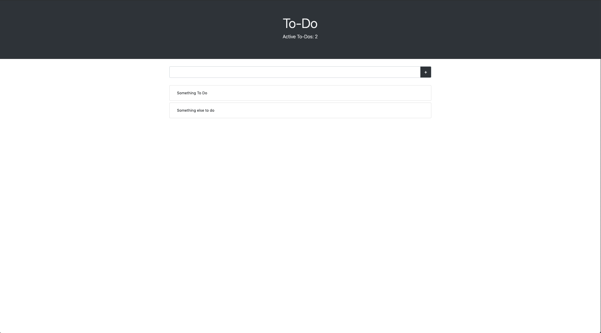

# To-Do App

Basic To-Do Application, implemented using React's new Hooks API. 

## Usage

* Clone this repo: 
    ```
    $ git clone https://github.com/JayRodrig/test-react-todomvc.git
    ```
* `cd` into `/test-react-todomvc` and run `npm install`:
    ```
    $ cd /test-react-todomvc && npm install
    ```
* Start app:
    ```
    $ npm start
    ```

## Screenshots:

> 